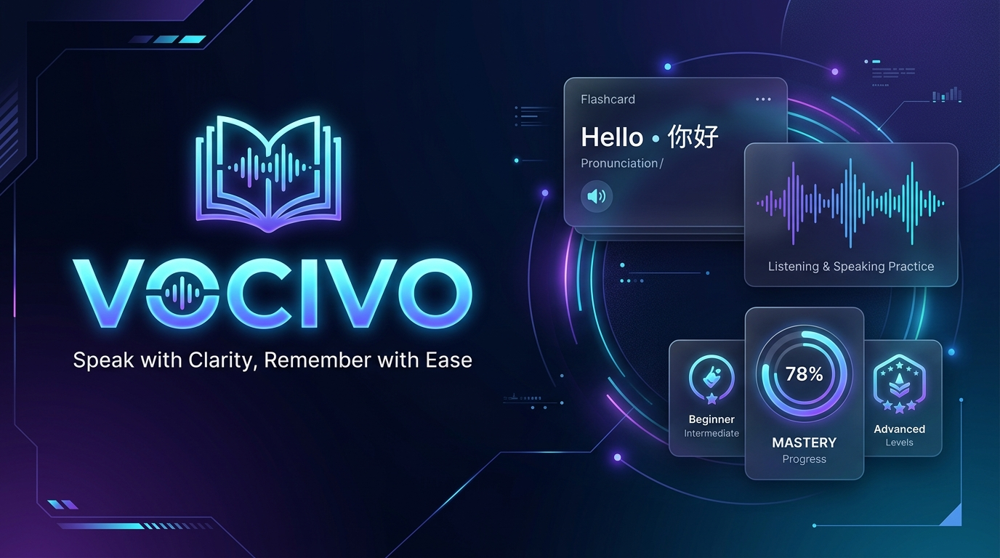
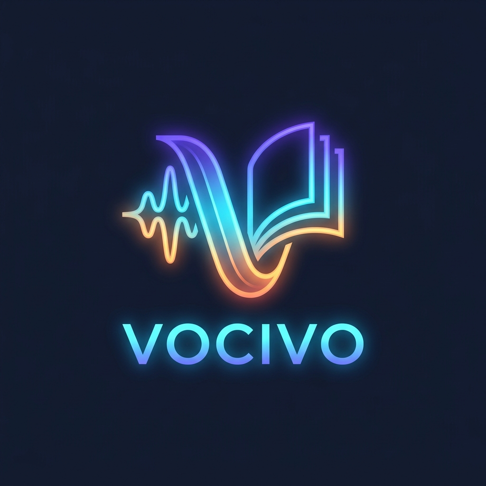

<div align="center">

# 🗣️ Vocivo

**Từ vựng nhớ sâu • Tự tin cất lời**  
*Speak with Clarity, Remember with Ease*

[](https://flutter.dev)
[](https://dart.dev)
[](https://opensource.org/licenses/MIT)
[](https://sqlite.org)
[](https://ai.google.dev)
[]()

<br/>



<br/>
<br/>



<p align="center">
  <b>Vocivo</b> (kết hợp hoàn hảo giữa <b>Vocabulary</b> & <b>Voice</b>) là ứng dụng học ngoại ngữ thông minh song ngữ <b>Anh – Trung</b>.<br/>
  Ứng dụng kết hợp thuật toán lặp lại ngắt quãng <b>SM-2 (Spaced Repetition System)</b>, công nghệ luyện nói <b>Speech Shadowing</b> và trí tuệ nhân tạo <b>Google Gemini AI</b> giúp người học ghi nhớ từ vựng vĩnh viễn và tự tin phát âm chuẩn xác.
</p>

[Tính Năng Chính](#-tính-năng-nổi-bật) •
[Công Nghệ](#-kiến-trúc--công-nghệ) •
[Cài Đặt](#-hướng-dẫn-cài-đặt--chạy-dự-án) •
[Công Cụ Companion](#-công-cụ-companion-python) •
[Giấy Phép](#-giấy-phép-mit-license)

</div>

---

## 🌟 Điểm Nhấn Cốt Lõi

Vocivo giải quyết triệt để hai rào cản lớn nhất của người học ngoại ngữ:
1. **"Học trước quên sau"** — Giải quyết bằng thuật toán **SM-2 Spaced Repetition** tối ưu hoá thời điểm ôn tập trước khi từ vựng rơi vào điểm quên.
2. **"Biết từ nhưng không dám nói / phát âm sai"** — Giải quyết bằng chế độ **Luyện nói & Shadowing** tương tác với nhận diện giọng nói trực tiếp, chấm điểm và gợi ý chuẩn hóa.

---

## 🚀 Tính Năng Nổi Bật

### 🧠 1. Thuật Toán Lặp Lại Ngắt Quãng SM-2 (Spaced Repetition)
- Dựa trên nền tảng thuật toán SuperMemo 2 (SM-2) khoa học.
- 4 nút đánh giá xúc giác phong cách 3D: **Quên (Again)**, **Khó (Hard)**, **Tốt (Good)**, **Dễ (Easy)**.
- Tự động tính toán điểm dễ (Easiness Factor), khoảng cách ngày ôn tập (Interval) và số lần nhắc lại.

### 🎙️ 2. Luyện Nói & Speech Shadowing Thời Gian Thực
- Phát âm mẫu chuẩn bản xứ bằng **Text-to-Speech (TTS)** chất lượng cao cho cả tiếng Anh và tiếng Trung.
- Chế độ **Speech-to-Text (STT)** thu âm giọng đọc của bạn, phân tích phát âm và hiển thị độ chính xác ngay tức thì.
- Hỗ trợ phiên âm quốc tế **IPA** cho tiếng Anh và phiên âm **Pinyin (Bính âm)** có dấu thanh điệu chuẩn cho tiếng Trung.

### 🤖 3. AI Import Hub & Gemini BYOK (Bring Your Own Key)
- Tích hợp mô hình AI tiên tiến **Google Gemini 2.5 Flash / Flash Lite**.
- Cơ chế **BYOK (Bring Your Own Key)** an toàn: người dùng tự cấu hình API Key miễn phí từ Google AI Studio, bảo mật tuyệt đối trong bộ nhớ an toàn (`FlutterSecureStorage`).
- Tự động phân tích sâu từ vựng: trích xuất từ loại, định nghĩa tiếng Việt ngữ cảnh, từ đồng nghĩa, cụm từ cố định (collocations) và câu ví dụ song ngữ.

### 🔒 4. 100% Offline-First & Quyền Riêng Tư Tuyệt Đối
- Dữ liệu sổ từ và tiến độ học tập được lưu trữ cục bộ với **SQLite** (`sqflite` & `sqflite_common_ffi`).
- Toàn bộ tính năng ôn tập, lật thẻ, tra từ và ghi chép hoạt động trơn tru không cần kết nối mạng.
- Xuất/Nhập dữ liệu dự phòng dễ dàng qua file chuẩn định dạng JSON và CSV.

### 🎨 5. Giao Diện Hiện Đại & Thích Ứng Mọi Thiết Bị (Adaptive UI)
- Ngôn ngữ thiết kế Vocivo hiện đại với 2 gam màu chủ đạo: **Emerald Green** (Sự phát triển, học tập) & **Vibrant Indigo / Violet** (Trí tuệ, công nghệ).
- Hỗ trợ chuyển đổi mượt mà giữa **Dark Mode** & **Light Mode**.
- Bố cục responsive tối ưu:
  - **Mobile**: Giao diện tối ưu thao tác 1 tay, Bottom Navigation, cử chỉ vuốt thẻ mượt mà.
  - **Tablet / Desktop / Web**: Bố cục 2 cột (Master-Detail), Navigation Rail, phím tắt tiện lợi.

### 📈 6. Theo Dõi Tiến Trình & Gamification
- Hệ thống duy trì chuỗi học tập hàng ngày (**Daily Streak**).
- Thống kê trực quan số từ đã thành thạo (Mastered), đang học (Reviewing) và từ mới (New).

---

## 🛠️ Kiến Trúc & Công Nghệ

```
vocivo/
├── android/               # Cấu hình Android native (com.vocivo.app)
├── windows/               # Cấu hình Windows Desktop C++ runner
├── web/                   # Cấu hình Flutter Web & PWA manifest
├── assets/images/         # Logo, icon, banner thương hiệu Vocivo
├── lib/
│   ├── core/              # Theme, Database SQLite, Services (TTS, STT, AI, Sync)
│   ├── models/            # Mô hình dữ liệu (VocabularyItem, SrsProgress, DailyActivity)
│   ├── providers/         # State management với Flutter Riverpod
│   ├── screens/           # Giao diện (Home, Flashcard Review, Wordbook, Settings, Onboarding)
│   └── widgets/           # Các widget tái sử dụng (VocivoLogo, SRS Buttons, FilterChips)
├── test/                  # Unit tests & Widget smoke tests
└── tools/                 # Bộ công cụ đồng hành Python CLI
```

### Tech Stack
- **Framework**: [Flutter 3.x](https://flutter.dev) & [Dart 3.x](https://dart.dev)
- **Quản lý trạng thái (State Management)**: [Flutter Riverpod](https://riverpod.dev)
- **Cơ sở dữ liệu (Database)**: [SQLite](https://sqlite.org) (`sqflite`, `sqflite_common_ffi`, `sqlite3_flutter_libs`)
- **Trí tuệ nhân tạo (AI Engine)**: [Google Gemini API](https://ai.google.dev) (`gemini-2.5-flash`, `gemini-2.5-flash-lite`)
- **Âm thanh & Luyện giọng**: `flutter_tts`, `speech_to_text`
- **Bảo mật**: `flutter_secure_storage`
- **Typography & Icon**: Google Fonts (`Outfit`, `Plus Jakarta Sans`), Cupertino Icons, Material Icons

---

## 💻 Hướng Dẫn Cài Đặt & Chạy Dự Án

### Yêu Cầu Môi Trường
- Flutter SDK `>= 3.13.4`
- Dart SDK `>= 3.0.0`
- Android Studio / VS Code có cài đặt Flutter Extension
- *(Tùy chọn)* C++ build tools nếu chạy bản Windows Desktop

### 1. Clone Kho Mã Nguồn
```bash
git clone https://github.com/vocivo/vocivo.git
cd vocivo
```

### 2. Cài Đặt Dependencies
```bash
flutter pub get
```

### 3. Chạy Ứng Dụng

#### Trên Desktop (Windows):
```bash
flutter run -d windows
```

#### Trên Thiết Bị Di Động (Android):
```bash
flutter run -d android
```

#### Trên Trình Duyệt Web:
```bash
flutter run -d chrome
```

### 4. Chạy Kiểm Thử (Tests)
```bash
flutter test
```

---

## 🐍 Công Cụ Companion Python

Dự án cung cấp sẵn công cụ dòng lệnh Python tiện lợi tại thư mục [`tools/`](tools/README.md) giúp trích xuất và chuẩn bị từ vựng tự động từ tài liệu văn bản hoặc tệp văn bản thô:

```bash
# Cài đặt thư viện phụ trợ
pip install google-genai pydantic

# Trích xuất từ vựng từ tệp văn bản sang định dạng Vocivo JSON
python tools/vocab_extractor.py --input sample_text.txt --lang en --level B2 --api-key YOUR_GEMINI_KEY
```

Sau khi có tệp JSON xuất ra, bạn chỉ cần mở ứng dụng **Vocivo** ➔ **Sổ từ vựng** ➔ **AI Import Hub** ➔ chọn tệp để nạp vào hệ thống ôn tập.

---

## 🤝 Đóng Góp Phát Triển (Contributing)

Chúng tôi luôn hoan nghênh và đánh giá cao mọi sự đóng góp từ cộng đồng:
1. Fork dự án
2. Tạo nhánh tính năng mới (`git checkout -b feature/tinh-nang-moi`)
3. Commit các thay đổi (`git commit -m 'Thêm tính năng tuyệt vời'`)
4. Đẩy mã lên nhánh (`git push origin feature/tinh-nang-moi`)
5. Mở một **Pull Request**

---

## 📄 Giấy Phép (MIT License)

Dự án này được phân phối dưới giấy phép **MIT License**. Bạn hoàn toàn có quyền sử dụng, sửa đổi và phân phối lại cho mục đích cá nhân lẫn thương mại.

Xem chi tiết tại tệp [LICENSE](LICENSE).

---

<div align="center">
  <b>Vocivo</b> — Được phát triển với ❤️ vì tình yêu ngôn ngữ và công nghệ.<br/>
  <i>Vocabulary + Voice = Mastery.</i>
</div>
